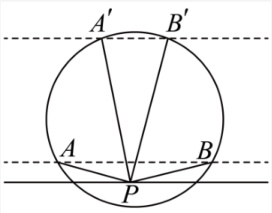
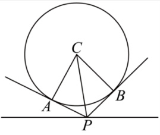
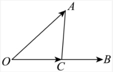
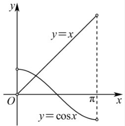
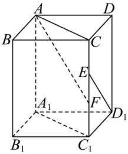
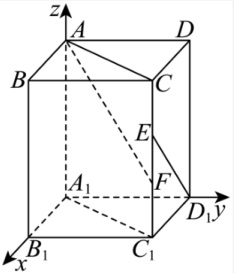
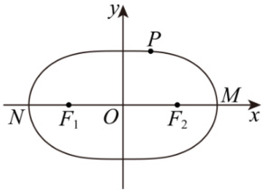

 ---------------------------------------------[ 第1页 ]---------------------------------------------  

# 浙江省金华十校 2025-2026 学年高三上学期一模考试数学试题  

学校：________姓名：________班级：________考号：________  

# 一、单选题  

1．已知集合 $U=\{1,2,3,4,5,6,7,8\}$ ， $A=\{2,3,4\}$ ，则集合 $\complement_{U}A=$（）  

A. $\{1\}$ B. $\{2,3,4\}$ C. $\{5,6,7,8\}$ D. $\{1,5,6,7,8\}$  

【答案】D  

【难度】0.94  

【知识点】补集的概念及运算  

【分析】应用集合的补运算求集合即可.  

【详解】由$U=\{1,2,3,4,5,6,7,8\}$，$A=\{2,3,4\}$，则$\complement_{U}A=\{1,5,6,7,8\}$.

故选：D  

2．已知等差数列$\{a_{n}\}$满足$a_{1}=2$,$a_{4}+a_{6}=20$，则$a_{3}=$（）  

A. 4

B. 6

C. 8

D. 10  

【答案】B  

【难度】0.85  

【知识点】等差中项的应用  

【分析】应用等差中项的性质得$a_{5}=10$，再由$a_{1}+a_{5}=2a_{3}$即可得出.  

【详解】由题设$a_{4}+a_{6}=2a_{5}=20\Rightarrow a_{5}=10$，而$a_{1}=2$， 所以$a_{1}+a_{5}=2a_{3}=12\Rightarrow a_{3}=6$。 故选：B  

3. $\frac{5}{2+i}=$ ( )  

A. $2+i$ B. $2-i$ C. $-2+i$ D. $-2-i$  

【答案】B  

【难度】0.85  

【知识点】复数代数形式的乘法运算、复数的除法运算  

【分析】应用复数的乘法及除法运算求解.  

 ---------------------------------------------[ 第2页 ]---------------------------------------------  

【详解】$\frac{5}{2+i}=\frac{(2+i)(2-i)}{2+i}=2-i$.

故选：B.  

4．已知$\frac{1}{\log_{9}a}+\frac{1}{\log_{27}a}=\frac{5}{3}$，则$a=$（）  

A. 3

B. 9

C. 27

D. 81  

【答案】C  

【难度】0.65  

【知识点】指数幂的运算、指数式与对数式的互化、对数的运算、运用换底公式化简计算

【分析】利用换底公式转化，进行求解即可.  

【详解】$\frac{1}{\log_{9}a}+\frac{1}{\log_{27}a}=\log_{a}9+\log_{a}27=\log_{a}3^{5}=\frac{5}{3}$，所以$a^{5}_{3}=3^{5}$，则$a^{5}=(3^{5})^{3}=27^{5}$，解得$a=27$。

故选：C。  

5．已知随机变量 $X\sim N\left(2, \sigma^{2}\right)$ ，且 $P\left(X<0\right)=0.3$ ，则 $P\left(0<X<4\right)$ 的值为（ ）  

A. 0.2 B. 0.4 C. 0.7 D. 0.35  

【答案】B  

【难度】0.65  

【知识点】指定区间的概率  

【分析】利用正态分布曲线的对称性求概率即可.  

【详解】由题设$P(X<2)=0.5$，且$P(X<0)=0.3$，则$P(0<X<2)=0.2$，由正态分布曲线关于$X=2$对称，则$P\big(0<X<4\big)=0.4$.

故选：B  

6．若圆C:(x\-1)^{2}+(y+3)^{2}=1上存在两点A,B，直线l:3x\-4y+m=0上存在点P，使得 $\angle APB=60^{\circ}$ ，则实数m的取值范围为（ ）  

A. $[-25,-5]$

B. $(-\infty,-25)\cup[-5,+\infty)$

C. $[-35,5]$

D. $(-\infty,-35)\cup[5,+\infty)$  

【答案】A  

【难度】0.15  

 ---------------------------------------------[ 第3页 ]---------------------------------------------  

【知识点】求点到直线的距离、由直线与圆的位置关系求参数  

【分析】将题干条件，结合几何知识转化为圆心C到直线的距离d需满足$d\leq2r$，解该不等式即可求解.  

【详解】当直线与圆相交时，如图所示，若 $A$、$B$ 离直线越近时，直至与直线和圆 $C$ 的两交点重合，此时 $\angle APB=\pi$， 若 $A$、$B$ 相距越来越近时，直至 $A$、$B$ 两点重合，此时 $\angle APB=0^{\circ}$， 所以一定存在 $A$、$B$ 及 $P$，使得 $\angle APB=60^{\circ}$；  

{width=22%}  

当直线与圆相切时，同直线与圆相交分析可知，一定存在 $A$、$B$ 及 $P$，使得 $\angle APB=60^{\circ}$；当直线与圆没有公共点时，对直线上的任一点 $P$，若 $A$、$B$ 相距越来越近时，直至 $A$、$B$ 两点重合时，仍有 $\angle APB=0^{\circ}$，另一方面，若 $PB$ 与圆 $C$ 相切于 $B$，$PA$ 与圆 $C$ 相切于 $A$，此时 $\angle APB$ 必为该 $P$ 点所能达到的最大情况，如图所示，  

{width=22%}  

由图可知$\sin\angle CPA=\frac{r}{CP}$，$\angle APB=2\angle CPA$，CP最短时，即等于圆心C到直线的距离d，$\sin\angle CPA$最大，$\angle CPA$也最大，同时$\angle APB$最大，所以若圆C上存在两点A,B，直线I上存在点P，使得$\angle APB=60^{\circ}=\frac{\pi}{3}$，则必有$\frac{r}{d}\geq\sin\frac{\pi}{6}=\frac{1}{2}$，解得$d\leq2r$，又因为圆C的半径$r=1$，圆心C(1,-3)到直线3x-4y+m=0的距离d=$\frac{|3\times1-4\times(-3)+m|}{\sqrt{3^{2}+(-4)^{2}}}$=$\frac{|m+15|}{5}$，所以$\frac{|m+15|}{5}\leq2$，解得-25≤m≤-5。  

 ---------------------------------------------[ 第4页 ]---------------------------------------------  

7. 设$\theta$为两个非零向量$\vec{a},\vec{b}$所成的角，已知对任意$t\in\mathbb{R}$，$|\vec{a}-t\vec{b}|$的最小值为$\frac{1}{2}|\vec{a}|$，则$\theta=$（）  

A. $\frac{\pi}{6}$ B. $\frac{\pi}{3}$ C. $\frac{\pi}{6}$ 或 $\frac{5\pi}{6}$ D. $\frac{\pi}{3}$ 或 $\frac{2\pi}{3}$  

【答案】C  

【难度】0.4  

【知识点】向量减法法则的几何应用、向量与几何最值  

【分析】令$\overrightarrow{a}=\overrightarrow{OA}$，$\overrightarrow{b}=\overrightarrow{OB}$，$\overrightarrow{b}=\overrightarrow{OC}$，根据向量减法及模的几何意义得$|\overrightarrow{a}-\overrightarrow{tb}|$即为线段AC的长度，数形结合得$|\overrightarrow{a}|\sin\theta=\frac{1}{2}|\overrightarrow{a}|$，即可求夹角.  

【详解】令$\overline{a}=\overline{OA}$，$\overline{b}=\overline{OB}$，$\overline{t}\overline{b}=\overline{OC}$，如下图示，$|\overline{a}-\overline{t}\overline{b}|$即为线段AC的长度，  

{width=18%}  

由对任意$t\in\mathbb{R}$，$|\vec{a}-t\vec{b}|$的最小值为$\frac{1}{2}|\vec{a}|$，即$AC|_{\min}=\frac{1}{2}|\vec{a}|$，而$\angle AOB=\theta$，显然$AC\perp OB$时，线段$AC$最短，此时$|AC|_{\min}=\overline{OA}|\sin\theta=|\vec{a}|\sin\theta=\frac{1}{2}|\vec{a}|$，所以$\sin\theta=\frac{1}{2}$，又$\theta\in[0,\pi]$，故$\theta=\frac{\pi}{6}$或$\frac{5\pi}{6}$。

故选：C  

8．若双曲线$\frac{y^{2}}{a^{2}}-\frac{x^{2}}{b^{2}}=1(a>0,b>0)$不存在以点$(a,2a)$为中点的弦，则该双曲线离心率的取值范围为（）  

A. $\left(1,\frac{2\sqrt{3}}{3}\right]$ B. $\left(1,\frac{\sqrt{5}}{2}\right]$ C. $\left[\frac{\sqrt{5}}{2},\frac{2\sqrt{3}}{3}\right]$ D. $\left[\frac{\sqrt{5}}{2},+\infty\right)$  

【答案】C  

【难度】0.4  

【知识点】求双曲线的离心率或离心率的取值范围  

【分析】先判断点$(a,2a)$在双曲线外部或在双曲线上，得$\frac{(2a)^2}{a^2}-\frac{a^2}{b^2}\leq1$，再结合过该中点的  

 ---------------------------------------------[ 第5页 ]---------------------------------------------  

直线斜率 $|k| \leq \frac{a}{b}$ 可得另一不等式，最后求解出 $\frac{b}{a}$ 的范围，结合离心率等式即可求解.  

【详解】由题意得点$(a,2a)$在双曲线外部或在双曲线上，则$\frac{(2a)^2}{a^2}-\frac{a^2}{b^2}\leq1$，得$\frac{b^2}{a^2}\leq\frac{1}{3}$， 假设存在以$(a,2a)$为中点的弦，设弦与双曲线交于点$A(x_1,y_1)$，$B(x_2,y_2)$， 则$\frac{x_1+x_2}{2}=a$， $\frac{y_1+y_2}{2}=2a$， 由点$A(x_1,y_1)$，$B(x_2,y_2)$在双曲线上，得$\left(\frac{y_1^2}{a^2}-\frac{x_1^2}{b^2}=1 \right)$ ， 由点$A(x_1,y_1)$，$B(x_2,y_2)$在双曲线上，得 $\left(\frac{y_2^2}{a^2}-\frac{x_2^2}{b^2}=1 \right)$ 两式作差得$\frac{(y_1+y_2)(y_1-y_2)}{a^2}=\frac{(x_1+x_2)(x_1-x_2)}{b^2} $， 所以$k_{AB}=\frac{y_1-y_2}{x_1-x_2}=\frac{a^2(x_1+x_2)}{b^2(y_1+y_2)}=\frac{a^2\cdot2a}{b^2\cdot4a}=\frac{a^2}{2b^2}$， 因为不存在该中点弦，所以直线$AB$与双曲线至多一个交点， 则$k_{AB}=\frac{a^2}{2b^2}\leq\frac{a}{b}$，也即$\frac{b}{a}\geq\frac{1}{2}$， 所以$\frac{1}{4}\leq\frac{b^2}{a^2}\leq\frac{1}{3}$，则$e=\frac{c}{a}=\sqrt{1+\frac{b^2}{a^2}}\in\left[\frac{\sqrt{5}}{2},\frac{2\sqrt{3}}{3}\right]$。 故选：C.  

# 二、多选题  

9．已知圆锥的侧面展开图是半径等于2的半圆，则圆锥的（）  

A．底面半径为1 B．表面积为$2\pi$

C．体积为$\frac{\sqrt{3}}{3}\pi$ D．外接球与内切球半径比值为3  

【答案】AC  

【难度】0.65  

【知识点】圆锥中截面的有关计算、圆锥表面积的有关计算、锥体体积的有关计算、多面体与球体内切外接问题  

【分析】根据已知有圆锥的母线长为2，底面周长为$2\pi$，进而求得底面半径，再结合圆锥的结构特征、表面积、体积的求法依次判断各项的正误.  

【详解】由题意，圆锥的母线长为2，底面周长为$2\pi$，  

 ---------------------------------------------[ 第6页 ]---------------------------------------------  

若底面半径为$r$，则$2\pi r=2\pi\Rightarrow r=1$，A对， 表面积为 $\frac{1}{2}\pi\times2^{2}+\pi\times1^{2}=3\pi$ ，B错， 由上，圆锥的高 $h=\sqrt{2^{2}-1^{2}}=\sqrt{3}$ ，则圆锥体积为 $\frac{1}{3}h\pi r^{2}=\frac{1}{3}\times\sqrt{3}\pi=\frac{\sqrt{3}}{3}\pi$ ，C对， 由上，圆锥轴截面是边长为2的等边三角形，其外接圆和内切圆半径，分别为圆锥的外接球 和内切球半径， 所以圆锥的外接球半径为 $\frac{2}{3}\times2\times\sin60^{\circ}=\frac{2}{\sqrt{3}}$ ，内切球半径为 $\frac{1}{3}\times2\times\sin60^{\circ}=\frac{1}{\sqrt{3}}$ ， 所以外接球与内切球半径比值为2，D错. 故选：AC  

10．已知函数 $f(x)=x^{2}(x-a)$ 在x=2处取得极小值，y=f'(x)为其导函数，则（）  

A. $a=3$

B. $f'(\sqrt{3}+1)-f'(1-\sqrt{2})<0$

C. $f(x)\geq-4$ 的解集为$\left[-1,+\infty\right)$

D. $\forall x>0,f\left(x+\frac{1}{x}\right)>f(-x-1)$  

【答案】ACD  

【难度】0.4  

【知识点】利用导数研究不等式恒成立问题、根据极值点求参数  

【分析】对于A，根据$f(x)$在x=2处取得极小值即可求解；对于B，根据$\sqrt{3}+1$和$1-\sqrt{2}$到$f'(x)$对称轴的距离即可判断；对于C，对$f(x)\geq-4$进行因式分解即可求解；对于D，因为$x>0$时，$x+\frac{1}{x}\geq2$、$-x-1<-1$，再结合$f(x)$的单调性以及$f(2)$、$f(-1)$的函数值即可求解.  

【详解】对于A， $f'(x)=3x^{2}-2ax$ ，由题意可知 $f'(2)=0$ ，解得a=3，此时 $f(x)=x^{2}(x-3)$ ，故A正确； 对于B，由 $f'(x)=3x^{2}-6x$ ，其为二次函数，开口向上，对称轴为x=$\frac{6}{2\cdot3}=1$ ， 则$\sqrt{3}+1$到对称轴的距离为 $\left|\sqrt{3}+1-1\right|=\sqrt{3}$ ， $1-\sqrt{2}$到对称轴的距离为 $\left|1-\sqrt{2}-1\right|=\sqrt{2}<\sqrt{3}$ ， 结合开口向上的二次函数图像特点可知，离对称轴较远的点函数值更大，也即 $f'(\sqrt{3}+1)>f'(1-\sqrt{2})$ ，即 $f'(\sqrt{3}+1)-f'(1-\sqrt{2})>0$ ，故B错误； 对于C，解不等式 $f(x)\geq-4$ ，即 $x^{3}-3x^{2}\geq-4$ ，整理为 $x^{3}-3x^{2}+4\geq0$ ，  

 ---------------------------------------------[ 第7页 ]---------------------------------------------  

因式分解得$x^{3}-3x^{2}+4=(x+1)(x-2)^{2}\geq0$，解得$x\geq-1$，故解集为$[-1,+\infty)$，故C正确； 对于D，对于$\forall x>0$，有$x+\frac{1}{x}\geq2\sqrt{x\cdot\frac{1}{x}}=2$，当且仅当$x=1$时取等号，同时 $-x-1<-1$ ， 由于$f'(x)=3x^{2}-6x=3x(x-2)$，当$x<0$或$x>2$时， $f'(x)>0$， $f(x)$单调递增； 当$0<x<2$时， $f'(x)<0$， $f(x)$单调递减， 所以$f\left(x+\frac{1}{x}\right)\geq f(2)=-4$， $f(-x-1)<f(-1)=-4$，所以$\forall x>0$， $f\left(x+\frac{1}{x}\right)>f(-x-1)$， $\forall x$D正确。 故选：ACD.  

11. 在$\triangle ABC$中，若$A=\cos A$,$B=\cos(\cos B)$,$C=ktan(\sin C)$，则（）  

A. $A=B$ B. $B<C$ C. $C<\frac{\pi}{2}$ D. $k<2$  

【答案】ABD  

【难度】0.15  

【知识点】用导数判断或证明已知函数的单调性、余弦函数图象的应用、由不等式的性质比较数（式）大小、求函数零点或方程根的个数  

【分析】根据 $y=x$ 与 $y=\cos x$ 在 $(0, \pi)$ 上的图象及已知得到 $A=B$，结合零点存在性定理分析得 $\frac{\pi}{6}<A=B<\frac{\pi}{4}$，进而有 $C \in(\frac{\pi}{2}, \frac{2\pi}{3})$，再由 $y=\frac{x}{k}$、$y=\tan(\sin x)$ 在区间 $(\frac{\pi}{2}, \frac{2\pi}{3})$ 上单调性，得 $\frac{\pi}{2\tan 1}<k<\frac{2\pi}{3\tan \frac{\sqrt{3}}{2}}$，最后构造函数并应用导数证明 $\tan \frac{\sqrt{3}}{2}>\frac{\pi}{3}$，即可得.  

【详解】根据 $y=x$ 与 $y=\cos x$ 在 $(0,\pi)$ 上的图象，如下图示，  

{width=20%}  

显然 $y=x$ 与 $y=\cos x$ 在 $(0,\pi)$ 上有且仅有唯一交点,

即 $x=\cos x$ 在 $(0,\pi)$ 上有且仅有一个根，而 $A=\cos A$，$B=\cos(\cos B)$，

由 $A,B\in(0,\pi)$，所以 $A=\cos B$，且 $A=B$，A 对，  

 ---------------------------------------------[ 第8页 ]---------------------------------------------  

又$\frac{\pi}{6}<\cos\frac{\pi}{6}=\frac{\sqrt{3}}{2}$, $\frac{\pi}{4}>\cos\frac{\pi}{4}=\frac{\sqrt{2}}{2}$, 则$\frac{\pi}{6}<A=B<\frac{\pi}{4}$

所以$C=\pi-(A+B)\in(\frac{\pi}{2},\frac{2\pi}{3})$, 即$B<C$, B 对, C 错,

由$C\in(\frac{\pi}{2},\frac{2\pi}{3})$, 则$\sin C(\frac{\sqrt{3}}{2},1)$, 而$C=k\tan(\sin C)$中$k>0$,

由$y=\frac{x}{k}$在区间$(\frac{\pi}{2},\frac{2\pi}{3})$上单调递增, $y=\tan(\sin x)$在区间$(\frac{\pi}{2},\frac{2\pi}{3})$上单调递减,

所以, 只需$\left\{\frac{\pi}{2k}<\tan 1\right.$, 可得$\frac{\pi}{2\tan 1}<k<\frac{2\pi}{3}\tan \frac{\sqrt{3}}{2}$,

$\frac{2\pi}{3k}>\tan \frac{\sqrt{3}}{2}$

令$f(x)=\tan x-x-\frac{x^{3}}{3}$且$0<x<\frac{\pi}{2}$, 则$f'(x)=\frac{1}{\cos^{2}x}-1-x^{2}=1+\tan^{2}x-1-x^{2}=\tan^{2}x-x^{2}$,

对于$g(x)=\tan x-x$且$0<x<\frac{\pi}{2}$, 则$g'(x)=\frac{1-\cos^{2}x}{\cos^{2}x}>0$, 故$g(x)$在$(0,\frac{\pi}{2})$上单调递增,

所以$g(x)>g(0)=0\Rightarrow\tan x>x$, 即$\tan^{2}x>x^{2}$, 则$f'(x)>0$,

所以$f(x)$在$(0,\frac{\pi}{2})$上单调递增, 故$f(x)>f(0)=0$, 即$f(\frac{\sqrt{3}}{2})=\tan \frac{\sqrt{3}}{2}-\frac{\sqrt{3}}{2}-\frac{\sqrt{3}}{8}>0$,

所以$\tan \frac{\sqrt{3}}{2}>\frac{5\sqrt{3}}{8}$, 而$(15\sqrt{3})^{2}=675>64\pi^{2}=(8\pi)^{2}$, 则$15\sqrt{3}>8\pi$, 即$\frac{5\sqrt{3}}{8}>\frac{\pi}{3}$,

所以$\tan \frac{\sqrt{3}}{2}>\frac{\pi}{3}$, 故$\frac{2\pi}{3\tan \frac{\sqrt{3}}{2}}<2$, 即$k<2$, D 对.  

故选：ABD  

# 三、填空题  

12. $(1+x)^{5}$的展开式中$x^{3}$项的系数为______.  

【答案】10  

【难度】0.94  

【知识点】求指定项的系数  

【分析】根据二项式展开式的通项公式求得正确答案.  

【详解】(1+x)^5的展开式中$x^3$项的系数为$C_5^3=10$.

故答案为: 10  

13．△ABC 的三个内角A,B,C 的对边分别为a,b,c，满足C=$\frac{\pi}{4}$，且$a^{2}+b^{2}-c^{2}=4$，则△ABC 的面积为____.  

 ---------------------------------------------[ 第9页 ]---------------------------------------------  

【答案】1  

【难度】0.85  

【知识点】三角形面积公式及其应用、余弦定理解三角形  

【分析】由余弦定理结合三角形面积公式求解即可.  

【详解】由余弦定理可得：$c^{2}=a^{2}+b^{2}-2abc\cos\frac{\pi}{4}$，又$a^{2}+b^{2}-c^{2}=4$，得$c^{2}=c^{2}+4-\sqrt{2}ab$，解得$ab=2\sqrt{2}$，所以$\triangle ABC$的面积为$\frac{1}{2}absinC=1$；故答案为：1  

14．平面直角坐标系中，原点O处有一只蚂蚁，每过1秒，该蚂蚁都会随机地选择上、下、左、右四个方向之一移动一个单位长度，那么在6秒后，蚂蚁到原点O的距离等于$\sqrt{2}$的概率为____.  

【答案】$\frac{75}{256}$  

【难度】0.15  

【知识点】实际问题中的组合计数问题、计算古典概型问题的概率  

【分析】设蚂蚁右移a次、左移b次，上移c次、下移d次，则蚂蚁终点的坐标$(x,y)$满足 $x=a-b$， $y=c-d$， $a+b+c+d=6$，根据题意有$x^{2}+y^{2}=2$，由于a,b,c,d都是非负整数， 可推$|x|=1$， $|y|=1$，再设左右移动总次数m=a+b，上下移动总次数n=c+d，则根据 $a=\frac{m+(a-b)}{2}$，$b=\frac{m-(a-b)}{2}$需为整数可推m、n为奇数，据此根据m、n可分为三种情况： $m=1$、n=5、 $m=3$、n=3、 $m=5$，n=1，此时在每种情况中，依据分步乘法计数原理，算出 每种情况下的总路径数，最后相加即可得到最终的概率。  

【详解】蚂蚁每一秒有4种移动方向，共移动6秒，根据分步乘法计数原理，总路径数为 $4^{6}$ ， 若蚂蚁到原点O的距离为 $\sqrt{2}$ ，原点(0,0)到该点(x,y)的距离满足 $x^{2}+y^{2}=2$ ， 设蚂蚁右移a次、左移b次，则x=a\-b，上移c次、下移d次，则y=c\-d，总步数 a+b+c+d=6 ， 要满足 $x^{2}+y^{2}=2$ ，即 $(a\-b)^{2}+(c\-d)^{2}=2$ ，由于a,b,c,d都是非负整数，可能的组合必须 满足 $|x|=1$ ， $|y|=1$ ，此时， $a\-b=\pm1$ ， $c\-d=\pm1$ ，且 $(a+b)+(c+d)=6$ ，  

 ---------------------------------------------[ 第10页 ]---------------------------------------------  

设左右移动总次数为$m=a+b$，上下移动总次数为$n=c+d$，则$m+n=6$， 由于$a=\frac{m+(a-b)}{2}$，$b=\frac{m-(a-b)}{2}$需为整数，则$m$与$|a-b|$同奇偶，所以$m$为奇数，同理 n也为奇数， 又$m+n=6$，可能的组合有$m=1$，$n=5$、$m=3$，$n=3$、$m=5$，$n=1$， 当$m=1$，$n=5$时，左右移动1次，满足$|x|=1$的方式有2种，即左或右， 上下移动5次，满足$|y|=1$的方式有$c=3$，$d=2$或$c=2$，$d=3$，共$2\times C_{3}^{3}$种，即选3次上 移，剩下2次下移，或选2次上移，剩下3次下移， 其次，在6步中选1步用于左右移动，其余5步用于上下移动，$C_{6}^{1}$种，因此，此情况的路 径数为$C_{6}^{1}\times2\times2\times C_{5}^{3}=240$； 当$m=3$，$n=3$时，左右移动3次，满足$|x|=1$的方式有$a=2$，$b=1$或$a=1$，$b=2$，共$2\times C_{3}^{2}$ 种，上下移动3次，满足$|v|=1$的方式同理，共$2\times C_{3}^{2}$种， 此外，6步中选择3步左右移动，剩余上下移动，共$C_{6}^{3}$种， 因此，此情况的路径数为$C_{6}^{3}\times2\times C_{3}^{2}\times2\times C_{3}^{2}=20\times2\times3\times2\times3=720$； 当$m=5$，$n=1$时，与$m=1$，$n=5$对称，路径数为240； 当$m=5$， $n=1$时，与$m=1$，$n=5$对称，路径数为240； 满足条件的总路径数有$240+720+240=1200$，概率为$\frac{1200}{4^{6}}=\frac{75}{256}$。 故答案为： $\frac{75}{256}$ 。  

# 四、解答题  

15. 如图, 长方体 $ABCD-A_{1}B_{1}C_{1}D_{1}$ 中, $AB=BC=2$, $AA_{1}=3$, $E$, $F$ 三等分 $CC_{1}$.  

{width=17%}  

(1)求证：$D_{1}E\perp AF$；  

 ---------------------------------------------[ 第11页 ]---------------------------------------------  

(2)求直线$D_{1}E$与平面$AA_{1}C_{1}C$所成角的大小.  

【答案】(1)证明见解析

(2) $30^{\circ}$  

【难度】0.65  

【知识点】求空间图形上的点的坐标、空间位置关系的向量证明、线面角的向量求法  

【分析】(1)根据题意, 建立空间直角坐标系, 通过向量的数量积为零, 可证明.  

(2) 求解出平面 $AA_{1}C_{1}C$ 的法向量, 再根据空间线面角公式求解即可.  

【详解】(1) 根据题意, 六面体 $ABCD-A_{1}B_{1}C_{1}D_{1}$ 为长方体, 所以 $AA_{1} \perp A_{1}D_{1}$, $AA_{1} \perp A_{1}B_{1}$, $A_{1}D_{1} \perp A_{1}B_{1}$,

如图, 以 $A_{1}$ 为坐标原点, 以 $A_{1}B_{1}$, $A_{1}D_{1}$, $A_{1}A$ 分别为 $x$, $y$, $z$ 轴正方向建立空间直角坐标系,

因为 $AB=BC=2$, $AA_{1}=3$, $E$, $F$ 为 $CC_{1}$ 的三等分点,

得各点坐标 $B_{1}\left(2,0,0\right)$, $D_{1}\left(0,2,0\right)$, $A\left(0,0,3\right)$, $E\left(2,2,2\right)$, $F\left(2,2,1\right)$,  

{width=19%}  

则 $\overline{D_{1}E}=(2,0,2)$ ， $\overline{AF}=(2,2,-2)$ ，所以 $\overline{D_{1}E}\cdot\overline{AF}=0$ ，即 $D_{1}E\perp AF$.  

(2) 因为 $AA_{1} \perp$ 平面 $A_{1}B_{1}C_{1}D_{1}$, $B_{1}D_{1} \subset$ 平面 $A_{1}B_{1}C_{1}D_{1}$, 所以 $B_{1}D_{1} \perp AA_{1}$, 因为 $B_{1}D_{1} \perp A_{1}C_{1}$, $AC / / A_{1}C_{1}$, 所以 $B_{1}D_{1} \perp AC$,

又因为 $AC \cap AA_{1}=A$, 所以 $B_{1}D_{1} \perp$ 平面 $AA_{1}C_{1}C$, 所以 $\overline{B_{1}D_{1}}=(-2,2,0)$ 为平面 $AA_{1}C_{1}C$ 的法向量, $\overline{D_{1}E}=(2,0,2)$,  

 ---------------------------------------------[ 第12页 ]---------------------------------------------  

设直线与平面所成角为$\theta$，则$\sin\theta=\frac{|\overline{B_{i}D_{1}}\cdot\overline{D_{1}E}|}{|\overline{B_{i}D}||\overline{D_{1}E}|}=\frac{-|4|}{2\sqrt{2}\times2\sqrt{2}}=\frac{1}{2}$，因为直线与平面所成角的范围为$\left[0,\frac{\pi}{2}\right]$，

所以直线$D_{1}E$与平面$AA_{1}C_{1}C$所成角为30°。  

16. 近些年汽车市场发生了翻天覆地的变化，新能源汽车发展迅速，下表统计了2021 年到 2024 年某地新能源汽车销量（单位：千辆）  

| 年份 | 2021 | 2022 | 2023 | 2024 |
| --- | --- | --- | --- | --- |
| 年份代号x | 1 | 2 | 3 | 4 |
| 销量y | 33 | 69 | 93 | 129 |  

附：相关系数 $r=\frac{\sum_{i=1}^{n}\left(x_{i}-\overline{x}\right)\left(y_{i}-\overline{y}\right)}{\sqrt{\sum_{i=1}^{n}\left(x_{i}-\overline{x}\right)^{2}}\sqrt{\sum_{i=1}^{n}\left(y_{i}-\overline{y}\right)^{2}}} }$ ； 回归方程 $\hat{y}=\hat{b}x+\hat{a}$ 中斜率和截距的最小二乘法估计公式分别为 $\hat{b}=\frac{\sum_{i=1}^{n}\left(x_{i}-\overline{x}\right)\left(y_{i}-\overline{y}\right)}{\sum_{i=1}^{n}\left(x_{i}-\overline{x}\right)^{2}}$ ， $\hat{a}=\overline{y}-\hat{b}\overline{x}$ ， $\sum_{i=1}^{4}x_{i}y_{i}=966$ , $\sum_{i=1}^{4}\left(y_{i}-\overline{y}\right)^{2}=4896$ ,$\sqrt{170}\approx13.04$ .  

(1)试根据样本相关系数$r$的值判断该地汽车销量$y$与年份代号$x$的线性相关性强弱

$(0.75\leq|r|\leq1)$, 则认为$y$与$x$的线性相关性较强, $|r|<0.75$, 则认为$y$与$x$的线性相关性较弱); (精确到0.001)  

(2)建立 $y$ 关于 $x$ 的线性回归方程，并预测该地 2025 年的新能源汽车销量.  

【答案】(1)$y$与$x$具有较强的线性相关关系

(2)$\hat{y}=31.2x+3$，159（千辆）  

【难度】0.85  

【知识点】相关系数的计算、根据回归方程进行数据估计  

【分析】（1）根据题干所给数据算出$\sum_{i=1}^{4}(x_{i}-\overline{x})(y_{i}-\overline{y})$，$\sum_{i=1}^{4}(x_{i}-\overline{x})^{2}$，$\sum_{i=1}^{i=1}(y_{i}-\overline{y})^{2}$，代入相关系数计算公式计算即可；  

(2)根据(1)算出的结果进一步算出$\hat{b}$,再根据线性回归方程经过$(\bar{x},\bar{y})$计算$\hat{a}$,最后把x=5  

 ---------------------------------------------[ 第13页 ]---------------------------------------------  

代入回归直线方程即可求解.  

【详解】(1) 已知 $n=4$， $x_{1}=1, x_{2}=2, x_{3}=3, x_{4}=4$，则 $\overline{x}=\frac{1+2+3+4}{4}=2.5$， $y_{1}=33, y_{2}=69, y_{3}=93, y_{4}=129$，则 $\overline{y}=\frac{33+69+93+129}{4}=81$， $\sum_{i=1}^{4} x_{i}^{2}=1^{2}+2^{2}+3^{2}+4^{2}=1+4+9+16=30$， $4 \overline{x}^{2}=4 \times 2.5^{2}=25$，所以 $\sum_{i=1}^{4} \left(x_{i}-\overline{x}\right)^{2}=\sum_{i=1}^{4} x_{i}^{2}-4 \overline{x}^{2}=30-25=5$， $\text { 已知 } \sum_{i=1}^{4} x_{i} y_{i}=966$ ，故 $\sum_{i=1}^{4} \left(x_{i}-\overline{x}\right)\left(y_{i}-\overline{y}\right)=\sum_{i=1}^{4} x_{i} y_{i}-4 \overline{x} \cdot \overline{y}=\sum_{i=1}^{4} x_{i} y_{i}-4 \overline{x} \cdot \overline{y}=966-4 \times 2.5 \times 81=156$ ， 又 $\sum_{i=1}^{4} \left(y_{i}-\overline{y}\right)^{2}=4896$ ，代入相关系数公式， 可得 $r=\frac{\sum_{i=1}^{n}\left(x_{i}-\overline{x}\right)\left(y_{i}-\overline{y}\right)}{\sqrt{\sum_{i=1}^{n}\left(x_{i}-\overline{x}\right)^{2}} \sqrt{\sum_{i=1}^{n}\left(y_{i}-\overline{y}\right)^{2}}=\frac{156}{\sqrt{5} \times 4896}=\frac{156}{12 \sqrt{170}} \approx \frac{13}{13.04} \approx 0.997$ ， 因为 $|r|=0.997 \geq 0.75$ ，所以 $y$ 与 $x$ 具有较强的线性相关关系. (2) 根据 $\hat{b}=\frac{\sum_{i=1}^{4}\left(x_{i}-\overline{x}\right)\left(y_{i}-\overline{y}\right)}{\sum_{i=1}^{4}\left(x_{i}-\overline{x}\right)^{2}}$, $\hat{a}=\overline{y}-\hat{b} \overline{x}$ ， 由（1）可知 $\sum_{i=1}^{4}\left(x_{i}-\overline{x}\right)\left(y_{i}-\overline{y}\right)=156$ ， $\sum_{i=1}^{4}\left(x_{i}-\overline{x}\right)^{2}=5$ ， 所以 $\hat{b}=\frac{156}{5}=31.2$ ， 由 $\hat{a}=\overline{y}-\hat{b} \overline{x}$ ， 已知 $\overline{x}=2.5$ ， $\overline{y}=81$ ， $\hat{b}=31.2$ ，则 $\hat{a}=81-31.2 \times 2.5=81-78=3$ ， 所以 $y$ 关于 $x$ 的线性回归方程为 $\hat{y}=31.2 x+3$ ，将 $x=5$ 代入线性回归方程 $\hat{y}=31.2 \times 5+3=159$ （千辆）.  

17. 已知数列$\{a_{n}\}$，$\{b_{n}\}$满足$\begin{cases}a_{n+1}=\frac{1}{2}a_{n}+\frac{3}{2}b_{n}\\b_{n+1}=\frac{1}{2}b_{n}+\frac{3}{2}a_{n}\end{cases}$（$n\in\mathbb{N}_{+}$），且$b_{1}=3a_{1}=\frac{3}{2}$.  

(1)证明：数列$\{a_{n}+b_{n}\}$与$\{a_{n}-b_{n}\}$均为等比数列；  

(2)求数列$\left[\left\{a_{n}\right\}\right]$的前25项和$S_{25}$．（其中$x$表示不超过$x$的最大整数，如$[1.2]=1$）  

【答案】(1)证明见解析;

(2)$2^{25}-14$.  

 ---------------------------------------------[ 第14页 ]---------------------------------------------  

【难度】0.65  

【知识点】由递推关系证明等比数列、求等比数列前n项和、分组（并项）法求和  

【分析】(1) 根据已知得$\begin{cases}a_{n+1}+b_{n+1}=2(a_{n}+b_{n})\\a_{n+1}-b_{n+1}=-\left(a_{n}-b_{n}\right)\end{cases}$, 结合等比数列的定义判断证明即可;  

(2) 由 (1) 得 $a_{n}+b_{n}=2^{n}$, $a_{n}-b_{n}=(-1)^{n}$, 进而有 $a_{n}=\frac{2^{n}+(-1)^{n}}{2}$, 根据新定义及分组求和、等比数列前 $n$ 项和公式求 $S_{25}$.  

【详解】(1) 由 $\left\{\begin{array}{l}a_{n+1}=\frac{1}{2}a_{n}+\frac{3}{2}b_{n} \\\ b_{n+1}=\frac{1}{2}b_{n}+\frac{3}{2}a_{n}\end{array}\right.$, 可得 $\left\{\begin{array}{l}a_{n+1}+b_{n+1}=2\left(a_{n}+b_{n}\right) \\ a_{n+1}-b_{n+1}=-\left(a_{n}-b_{n}\right)\end{array}\right.$, 又 $a_{1}+b_{1}=2\neq0, a_{1}-b_{1}=-1\neq0$ , 所以 $\left\{a_{n}+b_{n}\right\}$ 与 $\left\{a_{n}-b_{n}\right\}$ 均为等比数列;  

(2) 由 (1) 知 $a_{n}+b_{n}=2^{n}$, $a_{n}-b_{n}=(-1)^{n}$, 所以 $a_{n}=\frac{2^{n}+(-1)^{n}}{2}$, 则 $\left[a_{2 n}\right]=\left[\frac{2^{2 n}+1}{2}\right]=2^{2 n-1}$, $\left[a_{2 n-1}\right]=\left[\frac{2^{2 n-1}-1}{2}\right]=2^{2 n-2}-1$,

$S_{25}=\left(2^{0}-1+2^{1}\right)+\left(2^{2}-1+2^{3}\right)+...+\left(2^{22}-1+2^{23}\right)+2^{24}-1=\frac{(1-2^{25})}{1-2}-13=2^{25}-14$.  

18. 已知函数 $f(x)=e^{x}-x-1$.  

(1)求 $y=f(x)$ 在 $x=0$ 处的切线方程;

(2)若 $f(\ln x)\geq kx-x\ln x-1$ 恒成立, 求实数 $k$ 的取值范围;

(3)当 $a\geq1$ 时, 讨论 $g(x)=f(x)-ax\cos x$ 在区间 $\left(-\pi,\frac{\pi}{2}\right)$ 上零点的个数.  

【答案】(1) $y=0$;

(2) $(-\infty,1]$;

(3) 3 个.  

【难度】0.4  

【知识点】求在曲线上一点处的切线方程（斜率）、利用导数研究不等式恒成立问题、利用导数研究函数的零点  

【分析】（1）应用导数的几何意义求切线方程；  

（2）法一：应用分离参数法有$k\leq1+\ln x-\frac{\ln x}{x}$，再应用导数研究右侧的单调性求最小值，即  

 ---------------------------------------------[ 第15页 ]---------------------------------------------  

可得参数范围；法二：应用必要性探路，问题化为$h(x)=(x-1)\ln x+(1-k)x\geq0$，令 $h(1)\geq0\Rightarrow k\leq1$，再证明 $k\leq1$， $x>0$ 时，$h(x)\geq0$ 恒成立，确保充分性成立，即可得：  

(3) 由题设得 $x=0$ 是函数 $f(x)$ 的一个零点, 讨论 $x \in \left(-\frac{\pi}{2}, 0\right)$ 、 $x \in \left(0, \frac{\pi}{2}\right)$ 、 $x \in \left(-\pi, -\frac{\pi}{2}\right)$, 并利用导数研究函数的零点个数, 即可得.  

【详解】(1) 由 $f(x)=e^{x}-x-1$，则 $f'(x)=e^{x}-1$，显然 $f'(0)=f(0)=0$，所以切线方程为 $y=0$；  

(2) $f(x)=\mathrm{e}^{x}-x-1$，此时 $f(\ln x)\geq kx-x\ln x-1\Leftrightarrow x-\ln x-1\geq kx-x\ln x-1$，  

(2) $f(x)-e^{-x-1}$, 此时 $f(\ln x)\leq kx-\ln x-1$ , 此时 $f(\ln x)\leq kx-\ln x-1\leq kx-\ln x-1$

法一: 分离参数法, 从而 $kx\leq (x-1)\ln x+x\Rightarrow k\leq 1+\ln x-\frac{\ln x}{x}$ , 令 $h(x)=1+\ln x-\frac{\ln x}{x}$ , 则 $h'(x)=\frac{1}{x}-\frac{1-\ln x}{x^2}=\frac{x+\ln x-1}{x^2}$ , 所以 $h'(x)>0\Rightarrow x>1$, $h'(x)<0\Rightarrow 0<x<1$ , 所以 $h(x)$ 在 $(0,1)$ 单调递减, 在 $(1,+\infty)$ 单调递增, 因此 $h(x)_{\min}=h(1)=1$, 故 $k$ 的取值范围为 $(-\infty,1]$ ;

法二: 必要性探路, $x-\ln x-1\geq kx-x\ln x-1\Leftrightarrow (x-1)\ln x+(1-k)x\geq 0$ , 令 $h(x)=(x-1)\ln x+(1-k)x$, $h(1)=1-k\geq 0\Rightarrow k\leq 1$ , 下证: $k\leq 1$, $x>0$ 时, $h(x)\geq 0$ 恒成立, 由一次函数 $m(k)=(x-1)\ln x+x-kx$ 在 $(-\infty,1]$ 上递减, 则 $m(k)\geq m(1)\Rightarrow (x-1)\ln x+x-kx\geq (x-1)\ln x$ , 在 $x\in (0,1)$ 和 $x\in (1,+\infty)$ 上 $(x-1)\ln x>0$ 恒成立, 且 $x=1$ 时 $(x-1)\ln x=0$ , 所以 $g(x)\geq 0$ 恒成立, 故 $k$ 的取值范围为 $(-\infty,1]$ ;  

(3) $g(x)$在区间$\left(-\pi,\frac{\pi}{2}\right)$上有3个零点，理由如下：

由于$f(0)=0$，所以$x=0$是函数$f(x)$的一个零点，$g'(x)=e^{x}+a\left(x\sin x-\cos x\right)-1$，当$x\in\left(-\frac{\pi}{2},0\right)$时，此时$-ax\cos x>0$恒成立，又由（1）知$e^{x}-x-1>0$恒成立，  

 ---------------------------------------------[ 第16页 ]---------------------------------------------  

从而 $g(x)>0$ 恒成立, 所以 $g(x)$ 在区间 $x\left(-\frac{\pi}{2}, 0\right)$ 上没有零点;

当 $x \in\left(0, \frac{\pi}{2}\right)$ 时, 此时 $g^{\prime}(0)=-a<0$, $g^{\prime}\left(\frac{\pi}{2}\right)=\mathrm{e}^{\frac{\pi}{2}}+\frac{\pi}{2} a-1>\frac{\pi}{2}-1>0$,

若 $g^{\prime}(x)$ 是 $g^{\prime}(x)$ 的导数, 则 $g^{\prime}(x)=\mathrm{e}^{x}+a\left(2 \sin x+x \cos x\right)$,

由于 $2 \sin x+x \cos x>0$ 恒成立, 所以 $g^{\prime}\left(x\right)>0$, 即 $g^{\prime}\left(x\right)$ 在 $\left(0, \frac{\pi}{2}\right)$ 上单调递增,

从而存在 $x_{1} \in\left(0, \frac{\pi}{2}\right)$ 使得 $g^{\prime}\left(x_{1}\right)=0$, 且 $g^{\prime}\left(x\right)>0 \Rightarrow x_{1}<x<\frac{\pi}{2},  g^{\prime}(x)<0 \Rightarrow 0<x<x_{1}$,

即 $g\left(x\right)$ 在区间 $\left(0, x_{1}\right)$ 上递减, 区间 $\left(x_{1}, \frac{\pi}{2}\right)$ 上递增, 从而 $g\left(x_{1}\right)<g\left(0\right)=0$,

又 $g\left(\frac{\pi}{2}\right)=\mathrm{e}^{\frac{\pi}{2}}-\frac{\pi}{2}-1>0$, 所以 $g\left(x\right)$ 在 $\left(x_{1}, \frac{\pi}{2}\right)$ 有唯一零点, 即在 $\left(0, \frac{\pi}{2}\right)$ 上有唯一零点;

当 $x \in\left(-\pi,-\frac{\pi}{2}\right)$ 时, 此时 $x \sin x-\cos x>0$, 从而

$g^{\prime}\left(x\right)=\mathrm{e}^{\mathrm{x}}+a\left(x \sin x-\cos x\right)-1 \geq \mathrm{e}^{\mathrm{x}}+x \sin x-\cos x-1$,

由于 $x \in\left(-\pi,-\frac{\pi}{2}\right)$ 时, $x<\sin x$, 所以

$\mathrm{e}^{\mathrm{x}}+x \sin x-\cos x-1>\mathrm{e}^{\mathrm{x}}+\sin ^{2} x-\cos x-1=\mathrm{e}^{\mathrm{x}}-\left(\cos ^{2} x+\cos x\right)$,

又 $\cos ^{2} x+\cos x=\cos x \cdot\left(\cos x+1\right)<0$, 从而 $\mathrm{e}^{\mathrm{x}}+x \sin x-\cos x-1>\mathrm{e}^{\mathrm{x}}-\left(\cos ^{2} x+\cos x\right)>0$ 恒成立,

即 $g^{\prime}\left(x\right)>0$ 在 $x \in\left(-\pi,-\frac{\pi}{2}\right)$ 上恒成立, 所以 $g\left(x\right)$ 在区间 $x \in\left(-\pi,-\frac{\pi}{2}\right)$ 上单调递增,

因为 $g\left(-\frac{\pi}{2}\right)=\mathrm{e}^{\frac{\pi}{2}}+\frac{\pi}{2}-1>0$, $g\left(-\pi\right)=\mathrm{e}^{\pi}-a \pi+\pi-1 \leq \mathrm{e}^{-\pi}-1<0$,

因此 $g\left(x\right)$ 在区间 $x \in\left(-\pi,-\frac{\pi}{2}\right)$ 上有一定零点,

综上所述, 函数 $g\left(x\right)$ 在区间 $\left(-\pi, \frac{\pi}{2}\right)$ 上有 3 个零点.  

19. 如图, 已知点 $P$ 到两点 $F_{1}(-2,0)$, $F_{2}(2,0)$ 距离的乘积为 8, 点 $P$ 的轨迹记为曲线 $\Gamma$, $\Gamma$ 与 $x$ 轴交点分别记为 $M, N$.  

{width=24%}  

(1)求曲线$\Gamma$的方程;  

 ---------------------------------------------[ 第17页 ]---------------------------------------------  

(2)求$\triangle PMN$的周长的取值范围;  

(3)过$P$作直线分别交$y=\pm x$于两点$A,B$，且$\overrightarrow{AP}=\lambda\overrightarrow{PB}(\lambda>1)$，若$\triangle OAB$的面积为18，求$\lambda$的最小值.  

【答案】(1)$\left(x^{2}+y^{2}\right)^{2}-8\left(x^{2}-y^{2}\right)=48$;

(2)$\left[8\sqrt{3}, 4\sqrt{3}+2\sqrt{6+6\sqrt{3}}\right]$;

(3)$2+\sqrt{3}$.  

【难度】0.15  

【知识点】利用导数求函数的单调区间（不含参）、由方程研究曲线的性质、判断两曲线交点的个数、求平面轨迹方程  

【分析】(1)设$P(x,y)$，根据已知及两点距离公式得到方程，进而整理可得；  

(2) 令 $t=x^{2}+y^{2}$, 且 $M\left(2 \sqrt{3},0\right), N\left(-2 \sqrt{3},0\right), y \in[-2,2]$, 则 $t \in[4,12]$, 进而得到 $\left|PM\right|+\left|PN\right|$ 关于 $t$ 的表达式, 应用导数研究单调性求值域, 即可得三角形周长的范围;

(3) 设 $A\left(x_{1},x_{1}\right), B\left(x_{2},-x_{2}\right)$, 由已知得 $x_{1} x_{2}=\pm 18$, 曲线 $\Gamma$ 得 $\left(\frac{\lambda^{2} x_{1}^{2}+x_{2}^{2}}{\left(1+\lambda\right)^{2}}\right)^{-\frac{8 \lambda x_{1} x_{2}}{\left(1+\lambda\right)^{2}}=12}$, 令 $m=\frac{\lambda}{\left(1+\lambda\right)^{2}}$, 结合基本不等式及一元二次不等式的解法求参数范围, 即可得.  

【详解】(1) 设 $P(x,y)$, 则 $\sqrt{(x+2)^2+y^2}\cdot\sqrt{(x-2)^2+y^2}=8$ , 得 $x^4+y^4+2x^2y^2-8x^2+8y^2-48=0$ , 所以 $\left(x^2+y^2\right)^2-8\left(x^2-y^2\right)=48$ ; (2) 由 (1) 知 $M\left(2\sqrt{3},0\right)$, $N\left(-2\sqrt{3},0\right)$ , 令 $t=x^2+y^2$ , 由 (1) , 以 $x^2$ 为主元直接求根公式知 $x^2=4-y^2+4\sqrt{4-y^2}$ , 则 $y\in[-2,2]$, 则 $t=x^2+y^2=4+4\sqrt{4-y^2}\in[4,12]$ , 且 $8\left(x^2-y^2\right)=\left(x^2+y^2\right)^2-48$, $\left(|PM|+|PN|\right)^2=(\sqrt{(x+2\sqrt{3})^2+y^2}+\sqrt{(x-2\sqrt{3})^2+y^2})^2=2\left(x^2+y^2\right)+24+2\sqrt{\left(x^2+y^2\right)^2-24\left(x^2-y^2\right)+144}=2\left(t+\sqrt{288-2t^2}+12\right)$ ,  

 ---------------------------------------------[ 第18页 ]---------------------------------------------  

令 $f(t)=t+\sqrt{288-2t^{2}}$，则 $f'(t)=\frac{\sqrt{288-2t^{2}}-2t}{\sqrt{288-2t^{2}}}$，其中 $f'(4\sqrt{3})=\frac{\sqrt{192}-8\sqrt{3}}{\sqrt{192}}=0$，所以 $4\leq t<4\sqrt{3}$ 时 $f'(t)>0$，$4\sqrt{3}<t\leq12$ 时 $f'(t)<0$，则 $f(t)$ 在 $\left[4,4\sqrt{3}\right]$ 上单调递增，在 $\left(4\sqrt{3},12\right]$ 上单调递减，所以 $f(t)\in\left[12,12\sqrt{3}\right]$，即 $|PM|+|PN|\in\left[4\sqrt{3},2\sqrt{6+6\sqrt{3}}\right]$，而 $|MN|=4\sqrt{3}$，所以 $\Delta PMN$ 的周长的取值范围为 $\left[8\sqrt{3},4\sqrt{3}+2\sqrt{6+6\sqrt{3}}\right]$；  

{width=23%}  

(3) 设 $A\left(x_{1}, x_{1}\right), B\left(x_{2},-\text{-}x_{2}\right)$, 则 $18=\frac{1}{2}|OA|\cdot|OB|=|x_{1}x_{2}|$, 则 $x_{1}x_{2}=\pm 18$,

由题知 $\left\{\begin{array}{l}x-x_{1}=\lambda\left(x_{2}-x\right), \\ y-x_{1}=\lambda\left(-x_{2}-y\right)\end{array}\right.$, 则 $\left\{\begin{array}{l}x=\frac{x_{1}+\lambda x_{2}}{1+\lambda}, \\ y=\frac{x_{1}-\lambda x_{2}}{1+\lambda}\end{array}\right.$, 代入曲线 $\Gamma$ 得: $\left(\frac{\lambda^{2}x_{2}^{2}+x_{1}^{2}}{\left(1+\lambda\right)^{2}}\right)^{2}-\frac{8 \lambda x_{1} x_{2}}{\left(1+\lambda\right)^{2}}=12$,

令 $m=\frac{\lambda}{\left(1+\lambda\right)^{2}}$, 则

①当 $x_{1}x_{2}=18$ 时, $12=-\frac{144 \lambda}{\left(1+\lambda\right)^{2}}+\left(\frac{\lambda^{2} x_{2}^{2}+\frac{18^{2}}{x_{2}^{2}}}{\left(1+\lambda\right)^{2}}\right)^{2} \geq-144 m+36^{2} m^{2}$, 解得 $m \leq \frac{1}{6}$, 则

$\lambda \geq 2+\sqrt{3}$;

②当 $x_{1}x_{2}=-18$ 时, $12=\frac{144 \lambda}{\left(1+\lambda\right)^{2}}+\left(\frac{\lambda^{2} x_{2}^{2}+\frac{18^{2}}{x_{2}^{2}}}{\left(1+\lambda\right)^{2}}\right)^{2} \geq 144 m+36^{2} m^{2}$, 解得 $m \leq \frac{1}{18}$, 则

$\lambda \geq 8+3 \sqrt{7}$.  

综上所述：$\lambda$的最小值为$2+\sqrt{3}$.  